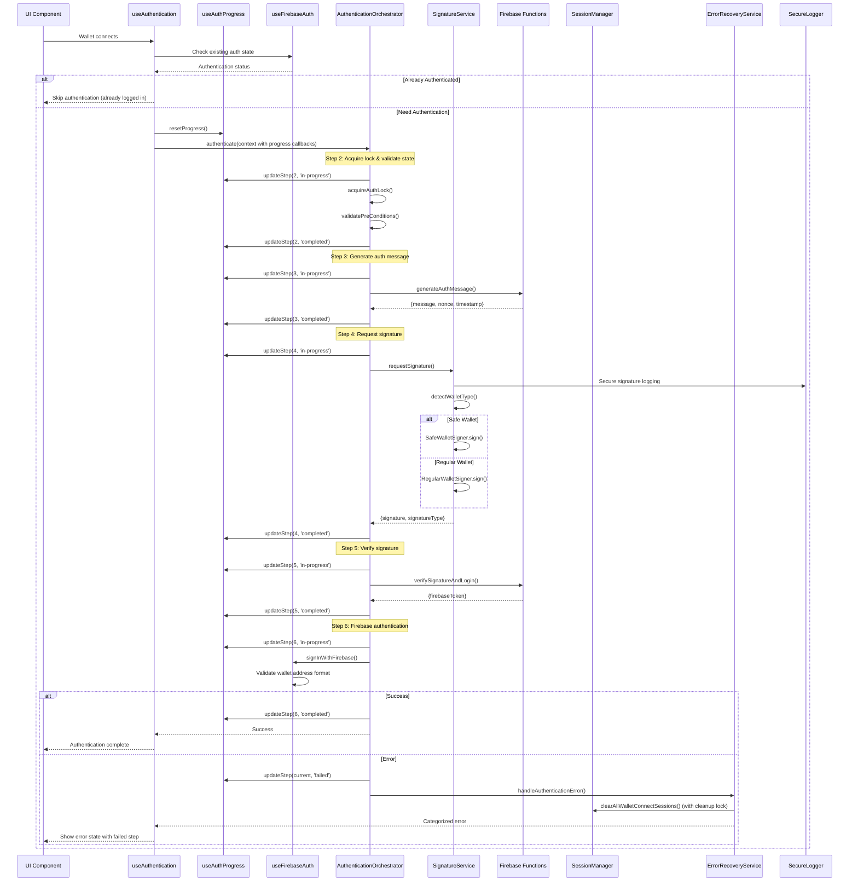

# SuperPool Mobile Authentication Architecture

This document provides comprehensive documentation for the SuperPool mobile app's authentication system, covering the interaction between services, hooks, and utilities.

## Overview

The authentication system is built on a **4-layer architecture**:
1. **Services Layer** - Core authentication logic and orchestration
2. **Hooks Layer** - React hooks for state management and UI integration
3. **Utils Layer** - Supporting utilities for session, error, and state management
4. **Components Layer** - UI integration (not covered in this document)

## Architecture Diagram

```
┌─────────────────────────────────────────────────────────────┐
│                        UI LAYER                             │
│  (Components using hooks for authentication state)          │
└─────────────────────────┬───────────────────────────────────┘
                          │
┌─────────────────────────▼───────────────────────────────────┐
│                     HOOKS LAYER                             │
│  useAuthentication (with progress) → useAuthenticationState │
│  useAuthenticationStateReadonly → useFirebaseAuth           │
│  useGlobalErrorHandler → useWalletConnectionTrigger         │
│  useWalletToasts → useLogoutState → useAuthProgress         │
└─────────────────────────┬───────────────────────────────────┘
                          │
┌─────────────────────────▼───────────────────────────────────┐
│                   SERVICES LAYER                            │
│  AuthenticationOrchestrator (with progress callbacks)       │
│  AuthErrorRecoveryService                                   │
│  SignatureService (enhanced security)                       │
└─────────────────────────┬───────────────────────────────────┘
                          │
┌─────────────────────────▼───────────────────────────────────┐
│                    UTILS LAYER                              │
│  ConnectionStateManager → SessionManager (with cleanup locks)│
│  FirebaseAuthManager → SecureLogger → ErrorHandling         │
│  Toast → AppCheckProvider                                   │
└─────────────────────────────────────────────────────────────┘
```

## 1. Services Layer (`src/services/`)

### AuthenticationOrchestrator

**Purpose**: Main orchestrator that coordinates the entire authentication flow
**File**: `authenticationOrchestrator.ts:31`

**Key Features:**
- **Authentication Locking**: Prevents concurrent authentication attempts using `AuthenticationLock`
- **State Validation**: Ensures wallet connection state remains consistent during auth flow
- **4-Step Flow**: Message generation → Signature → Verification → Firebase login
- **Error Handling**: Comprehensive error recovery through `AuthErrorRecoveryService`

**Critical Methods:**
- `authenticate()`: Main orchestration method (`authenticationOrchestrator.ts:307`)
- `acquireAuthLock()`: Prevents race conditions (`authenticationOrchestrator.ts:39`)
- `validateStateConsistency()`: Validates connection state at checkpoints (`authenticationOrchestrator.ts:260`)

### SignatureService

**Purpose**: Handles wallet signature requests with multi-wallet support
**File**: `signatureService.ts:208`

**Key Features:**
- **Wallet Detection**: Automatically detects Safe wallets vs. regular wallets
- **Signature Strategies**: EIP-712 typed data, personal sign, and Safe wallet authentication
- **Progressive Timeouts**: Different timeout strategies for different wallet types
- **Fallback Logic**: Falls back gracefully when signature methods fail

**Signature Types:**
- `typed-data`: EIP-712 structured data signing (preferred)
- `personal-sign`: Simple message signing (fallback)
- `safe-wallet`: Special authentication token for Safe wallets

### AuthErrorRecoveryService

**Purpose**: Comprehensive error handling and recovery system
**File**: `authErrorRecoveryService.ts:20`

**Key Features:**
- **Session Error Analysis**: Detects and handles WalletConnect session errors
- **Recovery Strategies**: Different recovery approaches based on error type
- **Cleanup Operations**: Comprehensive session cleanup through `SessionManager`
- **User Feedback**: Appropriate error messaging with timing

**Error Types Handled:**
- WalletConnect session errors (most critical)
- Timeout errors
- Connector errors
- Generic authentication failures

## 2. Hooks Layer (`src/hooks/`)

### useAuthentication

**Purpose**: Main authentication hook with progress tracking for active authentication flows
**File**: `useAuthentication.ts:11`

**Key Features:**
- **Progress Integration**: Integrates with `useAuthProgress` for 6-step visual feedback
- **Firebase State**: Uses `useFirebaseAuth` for persistent authentication state
- **Orchestrator Integration**: Creates and manages `AuthenticationOrchestrator` instance with progress callbacks
- **Connection Triggering**: Uses `useWalletConnectionTrigger` for automatic auth on new connections
- **Smart Skip Logic**: Avoids re-authentication if user already Firebase authenticated
- **Logout Protection**: Checks global logout state to prevent race conditions

### useAuthenticationStateReadonly

**Purpose**: Lightweight readonly authentication state for routing screens
**File**: `useAuthenticationStateReadonly.ts:12`

**Key Features:**
- **Read-Only Access**: Provides authentication state without triggering flows
- **Firebase Integration**: Combines Firebase auth state with authentication lock state
- **Routing Optimization**: Designed for screens that only need state for navigation decisions
- **Persistent State**: Uses Firebase wallet address as primary source of truth

### useFirebaseAuth

**Purpose**: Singleton Firebase authentication state management
**File**: `useFirebaseAuth.ts:8`

**Key Features:**
- **Singleton Pattern**: Uses `firebaseAuthManager` to prevent multiple Firebase listeners
- **State Persistence**: Maintains authentication state across app refreshes
- **Wallet Validation**: Validates Firebase UID matches valid wallet address format
- **Real-time Updates**: Provides live Firebase auth state changes

### useGlobalErrorHandler

**Purpose**: Global session corruption detection and recovery
**File**: `useGlobalErrorHandler.ts:10`

**Key Features:**
- **Session Corruption Detection**: Monitors console errors for session corruption patterns
- **Automatic Recovery**: Triggers session cleanup for corrupted sessions
- **Rate Limiting**: Prevents handling the same error multiple times
- **Console Interception**: Safely intercepts console.error for session error detection

### useAuthenticationState

**Purpose**: State management hook for authentication-related state
**File**: `useAuthenticationState.ts:21`

**Key Features:**
- **Error State**: Manages authentication errors
- **Lock Management**: Manages authentication lock to prevent concurrent attempts
- **Derived State**: Provides computed values like `isAuthenticating` and `authWalletAddress`

### useWalletConnectionTrigger

**Purpose**: Detects new wallet connections and triggers authentication
**File**: `useWalletConnectionTrigger.ts:9`

**Key Features:**
- **Connection Detection**: Monitors wallet connection state changes
- **Event Callbacks**: Triggers callbacks for new connections and disconnections
- **State Tracking**: Tracks previous connection state to detect changes
- **Stability Delay**: Small delay to ensure wallet connection is stable

### useLogoutState & useWalletToasts

**Supporting Hooks:**
- `useLogoutState`: Global logout state management
- `useWalletToasts`: Wallet connection/disconnection toast notifications

## 3. Utils Layer (`src/utils/`)

### ConnectionStateManager

**Purpose**: Manages atomic wallet connection state snapshots
**File**: `connectionStateManager.ts:9`

**Key Features:**
- **Atomic Snapshots**: Captures connection state at specific moments
- **State Validation**: Validates state hasn't changed during authentication
- **Sequence Tracking**: Uses sequence numbers to detect state changes

### SessionManager

**Purpose**: Manages WalletConnect and Reown AppKit sessions
**File**: `sessionManager.ts:16`

**Key Features:**
- **Comprehensive Cleanup**: Clears all WalletConnect-related storage keys
- **Session Detection**: Identifies and clears problematic sessions
- **Batch Operations**: Efficiently clears large numbers of storage keys
- **Debug Information**: Provides session debugging capabilities

**Critical Methods:**
- `clearAllWalletConnectSessions()`: Main cleanup method (`sessionManager.ts:17`)
- `forceResetAllConnections()`: Nuclear option for complete reset (`sessionManager.ts:191`)
- `clearSessionByErrorId()`: Targeted cleanup for specific session errors (`sessionManager.ts:224`)

### ErrorHandling

**Purpose**: Centralized error categorization and handling
**File**: `errorHandling.ts:36`

**Key Features:**
- **Error Categorization**: Automatically categorizes errors by type
- **User-Friendly Messages**: Provides appropriate error messages for each type
- **Error Types**: WALLET_CONNECTION, SIGNATURE_REJECTED, NETWORK_ERROR, etc.

### Toast System

**Purpose**: User feedback through toast notifications
**File**: `toast.ts:91`

**Key Features:**
- **Authentication Toasts**: Specialized toasts for auth flow steps
- **Extended Durations**: Longer durations for wallet app switching scenarios
- **Error-Specific Messaging**: Different toast styles based on error type

### FirebaseAuthManager

**Purpose**: Singleton Firebase authentication state manager with security validation
**File**: `firebaseAuthManager.ts:48`

**Key Features:**
- **Singleton Pattern**: Ensures only one Firebase auth listener globally
- **Wallet Address Validation**: Validates Firebase UID is a valid Ethereum address
- **State Persistence**: Maintains authentication state across app refreshes
- **Security Guards**: Prevents authentication bypass through UID manipulation
- **Listener Management**: Supports multiple components subscribing to auth state

**Critical Methods:**
- `addListener()`: Subscribe to Firebase auth state changes (`firebaseAuthManager.ts:94`)
- `getCurrentState()`: Get current auth state synchronously (`firebaseAuthManager.ts:114`)
- `extractWalletAddress()`: Safely extract and validate wallet address from user (`firebaseAuthManager.ts:30`)

### SecureLogger

**Purpose**: Production-safe logging utility with sensitive data protection
**File**: `secureLogger.ts:20`

**Key Features:**
- **Data Sanitization**: Automatically masks wallet addresses, signatures, and tokens
- **Environment-Aware**: Full logging in development, restricted in production
- **Sensitive Key Detection**: Recognizes and redacts sensitive object properties
- **Log Level Management**: Configurable logging levels (DEBUG, INFO, WARN, ERROR)

**Security Protection:**
- Masks wallet addresses (shows first 6 and last 4 characters)
- Redacts signature data and private keys
- Truncates long hex strings with length indicators
- Development-only detailed logging

### AppCheckProvider

**Purpose**: Firebase App Check token provider for device verification
**File**: `appCheckProvider.ts:31`

**Key Features:**
- **Device ID Generation**: Platform-specific device identification
- **Custom Token Provider**: Integrates with backend App Check system
- **Fallback Tokens**: Provides dummy tokens when device not approved

## 6-Step Authentication Progress System

The authentication system now provides real-time progress feedback through 6 distinct steps:

1. **Connect Wallet** ✓ (completed before authentication starts)
2. **Acquire Lock & Validate State** - Prevents concurrent auth attempts
3. **Generate Auth Message** - Backend creates signed message with nonce
4. **Request Signature** - User signs message in wallet app
5. **Verify Signature** - Backend validates signature authenticity
6. **Firebase Authentication** - Complete Firebase login process

**Progress Integration:**
- `useAuthProgress.ts` manages step state and visual indicators
- `AuthenticationOrchestrator` emits progress callbacks for each step
- UI components display step-by-step progress with checkmarks and spinners
- Failed steps show with error indicators and specific error messages

## Authentication Flow Sequence

### Complete Authentication Flow (with Progress Tracking)



## Error Recovery Strategies

### Session Error Recovery

When WalletConnect session errors occur:

1. **Detection**: `AuthErrorRecoveryService.analyzeSessionError()` identifies session errors
2. **Cleanup**: `SessionManager.clearAllWalletConnectSessions()` removes all related storage
3. **Disconnection**: Wallet is disconnected to force fresh connection
4. **User Feedback**: Specific session error toast is shown

### Generic Error Recovery

For other authentication errors:

1. **Categorization**: `categorizeError()` determines error type
2. **Recovery Decision**: Determine if wallet should be disconnected
3. **Timing**: Error feedback shown after appropriate delays
4. **Cleanup**: Firebase signout if needed

## Configuration Points

### Timeouts
- **Regular Wallets**: 15 seconds for signature requests
- **Safe Wallets**: 20 seconds for signature requests
- **Firebase Retry**: 3 attempts with increasing delays

### Session Storage Keys Cleared
- `@walletconnect/*` - WalletConnect core sessions
- `@reown/*` - Reown AppKit sessions
- `wagmi.*` - Wagmi cache and connection data
- Session ID patterns (`[a-f0-9]{64}`)

### Error Delay Strategies
- **User Cancellation**: 1.5 second delay
- **Technical Failures**: 2 second delay (after disconnect toast)
- **Session Errors**: 1.5 second delay with specific messaging

## Common Issues & Solutions

### Issue: "No matching key" Errors
**Cause**: Orphaned WalletConnect sessions in storage
**Solution**: `SessionManager.forceResetAllConnections()` provides comprehensive cleanup

### Issue: Safe Wallet Authentication Failures
**Cause**: Safe wallets can't sign standard messages
**Solution**: `SignatureService` automatically falls back to ownership verification tokens

### Issue: Concurrent Authentication Attempts
**Cause**: Multiple wallet connection events firing simultaneously
**Solution**: `AuthenticationLock` prevents concurrent attempts with proper cleanup

### Issue: Connection State Changes During Auth
**Cause**: User switches networks/wallets during authentication
**Solution**: `ConnectionStateManager` validates state consistency at checkpoints

## Testing Considerations

The authentication system includes comprehensive testing utilities:

### Hook Testing
1. **State Management Tests**: `useAuthenticationState.test.ts`
2. **Firebase Auth Tests**: Tests needed for `useFirebaseAuth.ts`
3. **Global Error Handler Tests**: Tests needed for `useGlobalErrorHandler.ts`
4. **Readonly State Tests**: Tests needed for `useAuthenticationStateReadonly.ts`
5. **Authentication Progress Tests**: Tests needed for enhanced `useAuthentication.ts`

### Service Testing
6. **Error Recovery Tests**: `authErrorRecoveryService.simple.test.ts`
7. **Signature Service Tests**: `signatureService.test.ts`

### Utility Testing
8. **Connection State Tests**: `connectionStateManager.test.ts`
9. **Session Manager Tests**: `sessionManager.test.ts`
10. **Security Validation Tests**: Tests needed for `firebaseAuthManager.ts` validation
11. **Secure Logging Tests**: Tests needed for `secureLogger.ts`

## Security Features

### Phase 1 Security Fixes (Latest)

1. **Wallet Address Validation**: Critical security fix preventing authentication bypass
   - Validates Firebase UID matches valid Ethereum address format (0x + 40 hex chars)
   - Prevents UID manipulation attacks in `firebaseAuthManager.ts:16`
   - Blocks authentication if UID doesn't match wallet address pattern

2. **Session Cleanup Race Condition Protection**: Atomic session cleanup operations
   - Added `withCleanupLock()` mechanism to prevent concurrent session operations
   - Protected methods: `clearAllWalletConnectSessions`, `clearSpecificSession`, `clearSessionByErrorId`
   - Ensures atomic session cleanup in `sessionManager.ts`

3. **Production Logging Security**: Secure logging with sensitive data protection
   - Created `secureLogger.ts` utility with automatic data sanitization
   - Masks wallet addresses, signatures, and Firebase tokens in production
   - Replaced 157+ console.log statements with secure logging
   - Development-only detailed logging for debugging

### Core Security Architecture

4. **Firebase App Check**: Device verification before authentication
5. **Atomic State Management**: Prevents race conditions and state inconsistencies
6. **Session Isolation**: Complete session cleanup prevents cross-authentication contamination
7. **Error Categorization**: Prevents sensitive error information leakage
8. **Signature Validation**: Multiple signature verification strategies
9. **Input Validation**: Comprehensive validation of wallet addresses, signatures, and UIDs
10. **Concurrency Safety**: Authentication locks and cleanup operation queuing

---

## Refactoring Recommendations

Based on the current architecture analysis, here are key areas that may need attention for the auth flow refactor:

1. **State Consistency**: The current system has complex state validation - consider simplifying
2. **Session Management**: Very aggressive session clearing - may need more targeted cleanup
3. **Error Recovery**: Comprehensive but complex - could benefit from consolidation
4. **Lock Management**: Authentication locking is effective but could be more React-friendly
5. **Safe Wallet Handling**: Special-casing throughout the system - consider more unified approach

The architecture is well-designed for handling complex wallet authentication scenarios but may benefit from simplification in certain areas during refactoring.